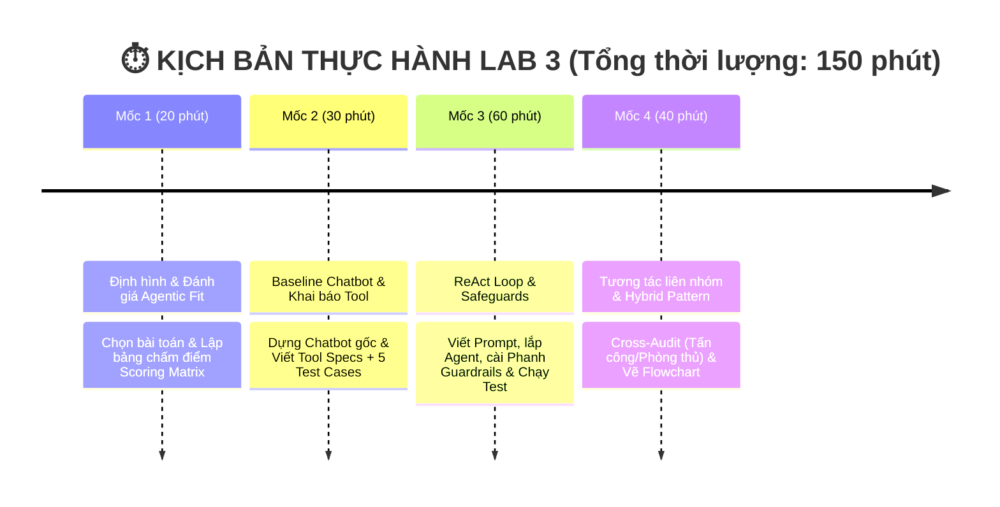

# 🏫 BÀI LAB 3: CHATBOT VS REACT AGENT - TỪ Ý TƯỞNG ĐẾN THỰC THI

---

### 💡 1. LỜI NÓI ĐẦU & NỀN TẢNG LÝ THUYẾT (4 CẤP ĐỘ AI HỘI THOẠI)

Bài Lab giúp bạn hiểu rõ sự tiến hóa qua 4 cấp độ của hệ thống AI:

| Cấp độ | Loại hệ thống | Đặc điểm chính | Sự xuất hiện trong Bài Lab |
| :---: | :--- | :--- | :--- |
| **Cấp 1** | **Rule-Based Bot** | Khớp từ khóa if/else cố định, không có LLM | *Minh họa lịch sử* |
| **Cấp 2** | **LLM Chatbot** | Dùng LLM sinh text mượt, nhưng không gọi được Tool | **Chatbot Baseline** (Phần thực hành 1) |
| **Cấp 3** | **Reactive Agent** | Suy luận `Thought -> Action -> Observation` & gọi Tool | **ReAct Agent Loop** (Trọng tâm Bài Lab) |
| **Cấp 4** | **Autonomous Agent** | Tự rã mục tiêu (Planning), tự đánh giá & có Memory | 🎁 **Phần Bonus Nâng cao (+10%)** |

* 🤖 **Chatbot thông thường (Cấp 2)**: Giống như một **chuyên gia lý thuyết** — chỉ trả lời dựa trên kiến thức tĩnh có sẵn trong LLM, không thể tra cứu số liệu thực tế hay tự thực hiện thao tác.
* 🧠 **ReAct Agent (Cấp 3)**: Giống như một **trợ lý thực hành** — vừa biết suy nghĩ (**Thought**), vừa biết chủ động dùng công cụ (**Action**) như phần mềm tra cứu/tính toán, và quan sát kết quả (**Observation**) để giải quyết các bài toán thực tế.

---

### 📂 2. CẤU TRÚC THƯ MỤC DỰ ÁN

> 🎯 **Đề tài nhóm chọn: #8 — Trợ Lý Duyệt Chi Phí Doanh Nghiệp.** Agent đóng vai
> AP/Finance Reviewer: tra chính sách → ngân sách → lịch sử trùng lặp → ma trận
> phân quyền, rồi kết luận `APPROVED` / `REJECTED` / `NEEDS_INFO` / `ESCALATE`.

```text
📁 Day03-Lab-Chatbot-vs-react-agent/
├── 📄 README.md                 <-- 📘 Tổng quan bài Lab & Thang điểm
├── 📄 .env.example              <-- 🔑 File mẫu API Key
├── 📄 requirements.txt          <-- 📦 Thư viện cần cài đặt
├── 📄 pytest.ini                <-- ⚙️ Cấu hình bộ test offline
│
├── 📁 config/                   <-- 🛠️ CẤU HÌNH & DỮ LIỆU
│   └── 📄 test_cases.json       <-- 🟢 [Role 1] Bộ đề 7 Test Cases thử thách AI
│
├── 📁 src/                      <-- 💻 MÃ NGUỒN PYTHON
│   ├── 📄 tools.py              <-- 🛠️ [Role 2] 7 công cụ + mock data chính sách/ngân sách
│   ├── 📄 prompts.py            <-- 🧠 [Role 3] ReAct System Prompt & Guardrails
│   ├── 📄 app.py                <-- 🚀 [Role 4] Core App ghép nối & chạy ReAct Loop
│   ├── 📄 providers.py          <-- 🔌 Multi-Provider Adapter + xoay model + tụt offline có nhãn
│   ├── 📄 key_pool.py           <-- 🔑 Xoay nhiều API key, trạng thái theo (key, model)
│   ├── 📄 web_demo.py           <-- 🖥️ Giao diện demo (stdlib, 0 dependency)
│   ├── 📄 llm_utils.py          <-- 🔁 Gọi LLM có retry khi hết quota (429)
│   ├── 📄 run_tests.py          <-- 🧪 [Role 1+5] Chạy 7 test cases & xuất báo cáo
│   ├── 📄 pre_demo_check.py     <-- 🚦 Kiểm thử trước demo (8 kiểm tra, 0 quota)
│   └── 📁 ai_levels/            <-- 📚 Demo 4 cấp độ AI (level4 = 🎁 Bonus Autonomous Agent)
│
├── 📁 tests/                    <-- ✅ BỘ TEST OFFLINE (không tốn quota LLM)
│
└── 📁 docs/                     <-- 📚 TÀI LIỆU HƯỚNG DẪN & BÁO CÁO
    ├── 📄 HUONG_DAN_CHAY_DEMO.md <-- 🖥️ [BẮT ĐẦU TỪ ĐÂY nếu mới] Cài đặt & chạy demo
    ├── 📄 CODELAB.md            <-- 🎓 [LMS Format] Hướng dẫn thực hành từng bước Codelab
    ├── 📄 PHAN_CONG_CONG_VIEC.md <-- 📋 [BẮT ĐẦU TẠI ĐÂY] Sổ tay thực hành & Checklist
    ├── 📄 DANH_SACH_DE_TAI.md    <-- 💡 Danh sách 10 chủ đề gợi ý
    ├── 📄 trace_eval.md          <-- 📊 [Tiêu chí 1+3] Agentic Fit & Trace log thật
    ├── 📄 cross_audit.md         <-- ⚔️ [Tiêu chí 4] Biên bản tấn công & phòng thủ
    ├── 📄 hybrid_flowchart.mermaid <-- 🔀 [Tiêu chí 5] Sơ đồ định tuyến Chatbot vs ReAct
    └── 📄 test_results.md        <-- 🧪 Kết quả 7 test cases (sinh tự động bởi run_tests.py)
```

### 🖥️ Giao diện demo

> 📖 **Chưa từng chạy dự án này?** Xem **[docs/HUONG_DAN_CHAY_DEMO.md](docs/HUONG_DAN_CHAY_DEMO.md)**
> — hướng dẫn từng bước từ `git clone` tới lúc mở được trình duyệt, kèm kịch bản
> trình bày và cách xử lý khi gặp lỗi.

```bash
python src/web_demo.py           # rồi mở http://localhost:8000
python src/web_demo.py --mock    # tập demo, không tốn một lượt quota nào
```

Chỉ dùng thư viện chuẩn của Python — **không phải cài thêm gì**. Giao diện gồm:

* Trace ReAct hiện **dần từng bước** (Thought → Action → Observation), guardrail
  hiện chip đỏ ngay tại chỗ.
* Nút chuyển **Cấp 2 Chatbot** ↔ **Cấp 3 ReAct** để so sánh trực tiếp trước lớp.
* Bảng trạng thái API key (giá trị đã che) — **không gọi mạng**, xem bao nhiêu
  lần cũng không tốn quota. Nút “Kiểm tra key” mới bắn đúng 1 request.
* Banner 🟢 LIVE / 🟡 đang xoay key / 🔴 **OFFLINE — KẾT QUẢ GIẢ LẬP**.

#### 🔑 Góp nhiều key để thoát trần quota

Free tier Gemini cho **20 request/ngày/model/project**. Bốn thành viên góp bốn
key thì thành 80. Khai báo trong `.env` theo bất kỳ dạng nào dưới đây (dùng được
cả ba cùng lúc, trùng nhau sẽ tự khử):

```bash
OPENAI_API_KEY=key_cua_ban_A
OPENAI_API_KEY_2=key_cua_ban_B
OPENAI_API_KEY_3=key_cua_ban_C
OPENAI_API_KEYS=key_D,key_E        # phân cách bằng dấu phẩy
```

#### 🛡️ Khi sự cố xảy ra giữa buổi demo

| Sự cố | Hệ thống làm gì |
| :--- | :--- |
| **Hết quota một key** | Xoay sang key kế tiếp. Quota tính theo cặp *(key, model)* nên key cạn trên model này vẫn dùng được trên model kia |
| **Hết quota mọi key** | Xoay sang model phụ (`LAB_MINI_MODEL` — hạn mức riêng) |
| **Key sai / bị thu hồi** | Loại khỏi phiên ngay, không thử lại (khác 429: chờ cũng vô ích) |
| **Mất mạng, máy chủ 503** | Coi là sự cố thoáng qua, thử lại tối đa 3 lần trước khi kết luận hỏng thật |
| **Hết cả key lẫn model** | Tụt về `MockProvider` **và dán nhãn đỏ** — demo chạy tiếp, không ai bị lừa rằng đó là LLM thật |
| **Backend chết giữa chừng** | Phiên ghi xuống `data/sessions/` sau mỗi bước; mở lại trang là nối tiếp đúng chỗ đang dở |

### ▶️ Chạy thử

```bash
# 🚦 CHẠY CÁI NÀY TRƯỚC KHI DEMO — 8 kiểm tra, không tốn một lượt quota nào
python src/pre_demo_check.py
python src/pre_demo_check.py --live                 # thêm ĐÚNG 1 request thật để xem key còn quota

python -m pytest tests/                             # bộ test offline, ~0,2 giây
python src/app.py                                   # Demo Chatbot Baseline vs ReAct Agent
python src/run_tests.py                             # Chạy cả 7 test cases, xuất docs/test_results.md
python src/run_tests.py --cases 3,6 --mode react    # Chạy chọn lọc
python src/run_tests.py --cases 7 --merge           # Chạy thêm, GIỮ kết quả lượt trước
python src/run_tests.py --rejudge                   # Chấm LẠI trace đã lưu, KHÔNG tốn quota
python src/run_tests.py --model gemini-3.5-flash-lite  # Đổi model khi hết quota ngày
python src/ai_levels/level4_autonomous_agent.py     # 🎁 Bonus: Autonomous Agent (Cấp 4)
```

> ⚠️ **Luôn `pytest` xanh hết rồi mới chạy LLM thật.** Free tier Gemini giới hạn
> **5 request/phút VÀ 20 request/ngày, tính riêng từng model** — một case đi đủ 5
> tool đã tốn 6 lượt gọi. Toàn bộ logic tool / parser / guardrail / chấm điểm đều
> kiểm được offline bằng `FakeProvider`, đừng đốt quota để tìm lỗi mà pytest bắt
> được miễn phí. Hết quota model chính thì đổi sang `--model gemini-3.5-flash-lite`
> (hạn mức riêng).

---

### ⏱️ 3. LỘ TRÌNH THỰC HÀNH (4 MỐC / 150 PHÚT)



---

### 💯 4. CƠ CHẾ CHẤM ĐIỂM  (SCORING RUBRIC)

| Tiêu chí                                |  Trọng số  | Mô tả chi tiết                                                                                                             | Bằng chứng kiểm tra (Artifacts)                                        |
| :---------------------------------------- | :-----------: | :---------------------------------------------------------------------------------------------------------------------------- | :------------------------------------------------------------------------ |
| **1. Agentic Fit & Test Design**    | **20%** | Phân tích đúng 4 tiêu chí Agentic Fit cho chủ đề tự chọn. Bộ test cases đủ góc cạnh (đơn giản, multi-step, edge cases). | Bảng chấm điểm (`docs/trace_eval.md`) + `config/test_cases.json`. |
| **2. ReAct Implementation & Tools** | **30%** | Tool description rõ ràng. Vòng lặp ReAct chạy đúng chuẩn `Thought -> Action -> Observation`.                         | Code trong `src/tools.py` + `src/app.py`.                              |
| **3. Guardrails & Observability**   | **20%** | Bắt được lỗi loop, có max iterations (Guardrail). Trích xuất được ít nhất 1 Trace log hoàn chỉnh.                     | File `src/prompts.py` + Log trong `docs/trace_eval.md`.                |
| **4. Inter-group Attack & Defense** | **20%** | Phản biện tốt khi gọi ngẫu nhiên hoặc cử 1 bạn đi chấm chéo (+10đ). Agent chống đỡ tốt / fallback chuẩn (+10đ).        | Biên bản Cross-Audit (`docs/cross_audit.md`) — 6 mũi tấn công + bảng phòng thủ. |
| **5. Hybrid Decision Flowchart**    | **10%** | Sơ đồ thể hiện rõ khi nào đi Chatbot path, khi nào đi ReAct Agent path.                                             | Sơ đồ Flowchart (`docs/hybrid_flowchart.mermaid`) + bảng tín hiệu định tuyến ở `docs/trace_eval.md` §5. |
| 🎁 **BONUS: Autonomous Agent**     | **+10%**| Thử nghiệm tính năng Planning (tự chia nhỏ mục tiêu) hoặc Memory cho Agent (Cấp 4).                                  | Demo code trong `src/app.py` hoặc giải trình trong report.           |

---

> 🚀 **BẮT ĐẦU LÀM BÀI**:
> Vui lòng mở sổ tay thực hành 👉 **[docs/PHAN_CONG_CONG_VIEC.md](docs/PHAN_CONG_CONG_VIEC.md)**
> để xem phân vai và checklist công việc cụ thể cho từng thành viên!
